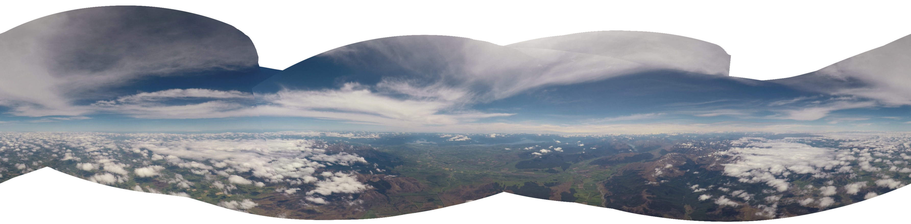
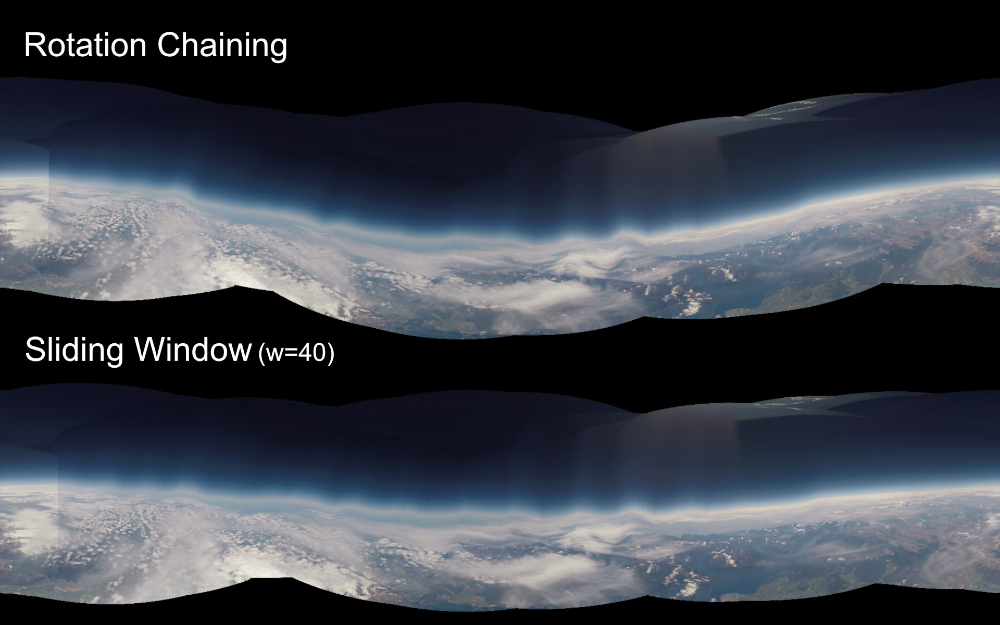
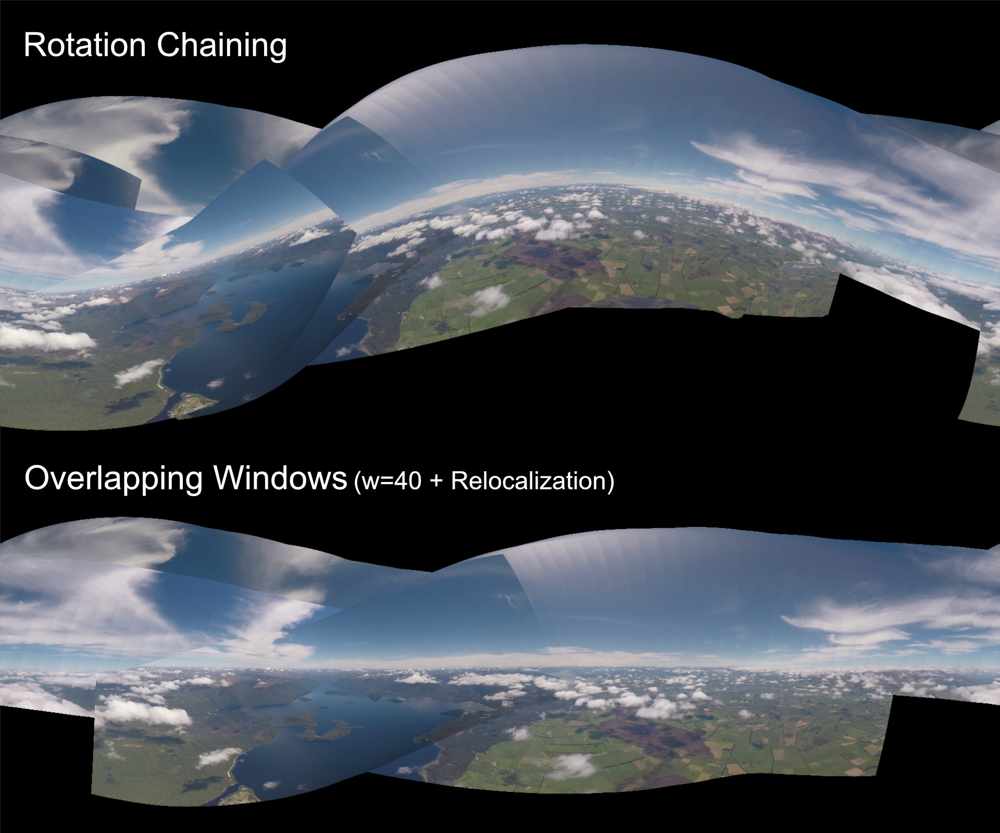

# Rotating 2D to Equirectangular 360 Video

Uses computer vision techniques to translate 2D video of a large scene, filmed with a rotating camera, into a stable 360 equirectangular video.

## Installation

```bash
git clone https://github.com/jeb5/COSC-490-360.git
cd COSC-490-360
pip install opencv-python torch torchvision pillow line-profiler av matplotlib scipy shapely progressbar2 git+https://github.com/google/spatial-media.git
```

## Usage

Create an input directory with the same format as `example_input/`. You need to provide a video file, a csv file with camera rotation data if available, and a `camera_information.json` file with camera parameters.

```bash
python src/VideoTo360.py example_input/ --produce_360
# See more options with:
python src/VideoTo360.py --help
```

## Visual Odometry
Uses SIFT feature detection and pairwise image matching to estimate relative camera orientation change between frames.
Global camera poses are then computed by combining all relative pose estimates and solving for an optimal set of camera orientations.


## Reprojection
Given an estimated camera orientation for each frame, 2D-to-equirectangular reprojection is performed, and the resulting equirectangular frames are stacked atop previous frames to create a full 360 video.


## Example Result Screenshots




